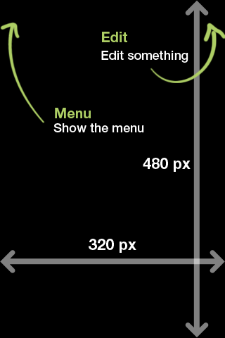
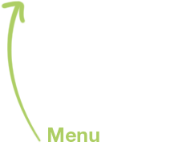

# jQuery Mobile Coach Marks

Coach Marks is a simple plugin to help add coach marks to your jquery mobile apps.

## Features

* Clones the target element and brings it above the modal.
* Automatic reposition of elements and images (arrows).
* Tap anywhere in the screen to close.
* Callback for closed Event, so you can handle the save of the status.

## Demo / Examples

[Demo / Examples](http://mzendejas.github.io/coach-marks/)

## Installation

Include script *after* the jQuery Mobile library:

    

## Usage

Coach Marks uses a simple pattern:

	$('div[data-role="page"]').on("pagebeforeshow", function(){
		var cur_page = $.mobile.activePage[0].id;
		
		...

		if( cur_page == "pagetoAddCoachMarks" )
		{
			$.mobile.activePage.coachmarks({
				'marks': { 
					'markName': {
						element: $('selector', $.mobile.activePage),
						clone: true,
						image: {
							src: "image_filename.png",
							pos: {
								top: 0,
								left: 0
							}
						}
					}
				}
			});
		}

		...

	});

We use the `$.mobile.activePage` as the target of the coachmarks plugin, beacuse we have to wait for jQuery Mobile to enhance the elements (buttons, forms, etc.) and the plugin automatically listens to the `pageshow` Event.

**Note:** The marks Object can have multiple mark Objects.

### JQM + Backbone.js

	render: function() {
		//First we render the view HTML.
		$(this.el).html( ... );
		//Then we can use the plugin.
		this.$el.coachmarks({
				'marks': { 
					'markName': {
						element: this.$('selector'),
						clone: true,
						image: {
							src: "image_filename.png",
							pos: {
								top: 0,
								left: 0
							}
						}
					}
				}
			});
		return this;
	}

Assuming that `this.$el` is the `div[data=role="page"]` element of the View.

## Configuration

### modalColor

Sets the background color of the modal.

**Default:** rgba(0, 0, 0, 0.75)

**Options:** Any value that `background-color` accepts.

### seen

Callback Function for when a user taps anywhere in the screen.

**Default:** none

## How to create a Coach Mark

			'marks': { 
				'menuBtn': {
					element: $('a#menu-btn', $.mobile.activePage),
					image: {
						src: "cm_ex1_menu.png",
						pos: {
							top: 25,
							left: -13
						},
						size: { w:200, h:80 }
					}
			},

Each Coach Mark needs a key, in the above example is `menuBtn`.

A Coach Mark is an object with the following properties:

### element

This is the target of the coach mark and useful to position the image relative to this element.

**Options:** jQuery object or selector.

**Example:**

	element: $('a#uniqueid'),

or

	element: 'a#uniqueid',

### clone

If set to true the target element is cloned to be above the modal.

**Default:** true

### cloneWidth

If set to true the cloned element's width would be the same as the target element's width.

**Default:** false

### css

This is a property-value object, as the jQuery css function, for the cloned element.

**Default:** none

**Example:**

	css: { 'margin':'0 px', 'padding':'0 px' },

### image

This property holds other properties of the image.

This property needs the following properties:

#### src

The filename of the image. The image files need to be in the `css/images/` folder.

**Example:**

	src: "cm_ex1_menu.png",

#### pos

This object is for the position of the image and holds 2 properties: `top` and `left`.

##### top

This is like the Y coordinate of the image, if the value is a number, the top position of the image will be relative to the target element of the `element` property, otherwise would be absolute.

If the number is positive, the image would be closer to the bottom.

	top: 5, //5 pixels below the top part of the element (if set) or the window

And if the number is negative would be closer to the top.

	top: -5, //5 pixels above the element (if set) or the window

But it also can be a function returning the value to set, receives 3 parameters:

* **w**, an object containing a `width` and a `height` properties of the `window`.
* **o**, an object containing all the mark properties, useful for using the size or position of the `image` or `text` property, `o.image.size.w` or `o.text.size.w`.
* **r**, an object containing a `top`, `left`, `w` (width) and `h` (height) properties of the target element.

Inside the function the `this` refers to the image object. So you can refer the size property like `this.size.w`.

	//Centers the image vertically and relative to the window
	top: function( w, o, r) {
		return Math.floor( ( w.height - this.size.h ) / 2 );
	}

##### left

This is like the X coordinate of the image, if the value is a number, the top position of the image will be relative to the target element of the `element` property, otherwise would be absolute.

If the number is positive, the image would be closer to the right.

	left: 5, //5 pixels to the right part of the element (if set) or the window

And if the number is negative would be closer to the left.

	left: -5, //5 pixels outside the element (if set) or the window

But it also can be a function returning the value to set, receives 3 parameters:

* **w**, an object containing a `width` and a `height` properties of the `window`.
* **o**, an object containing all the mark properties, useful for using the size or position of the `image` or `text` property, `o.image.size.w` or `o.text.size.w`.
* **r**, an object containing a `top`, `left`, `w` (width) and `h` (height) properties of the target element.

Inside the function the `this` refers to the image object. So you can refer the size property like `this.size.w`.

	//Centers the image horizontally and relative to the window
	left: function( w, o, r) {
		return Math.floor( ( w.width - this.size.w ) / 2 );
	}

##### size

An object containing a `w` property that holds the width of the image and a `h` property that holds the height of the image.

	size: { w:200, h:80 }

### text

This property holds other properties of the text image and is like the `image` property. This property is useful when you need to resize proportionally the image, but if the image has text, at some point it would be too small to read, so you can separate the text from the graphic (arrow, rectangles, etc.).

This property needs the following properties:

#### src

The filename of the image. The image files need to be in the `css/images/` folder.

**Example:**

	src: "cm_ex1_menu.png",

#### pos

This object is for the position of the image and holds 2 properties: `top` and `left`.

##### top

This is like the Y coordinate of the image, if the value is a number, the top position of the image will be relative to the target element of the `element` property, otherwise would be absolute.

If the number is positive, the image would be closer to the bottom.

	top: 5, //5 pixels below the top part of the element (if set) or the window

And if the number is negative would be closer to the top.

	top: -5, //5 pixels above the element (if set) or the window

But it also can be a function returning the value to set, receives 3 parameters:

* **w**, an object containing a `width` and a `height` properties of the `window`.
* **o**, an object containing all the mark properties, useful for using the size or position of the `image` or `text` property, `o.image.size.w` or `o.text.size.w`.
* **r**, an object containing a `top`, `left`, `w` (width) and `h` (height) properties of the target element.

Inside the function the `this` refers to the image object. So you can refer the size property like `this.size.w`.

	//Centers the image vertically and relative to the window
	top: function( w, o, r) {
		return Math.floor( ( w.height - this.size.h ) / 2 );
	}

	//Takes into account the height of the arrow image
	top: function( w, o, r) {
		return r.top + o.image.size.h + 5;//Add 5 pixels so there is a space between the 2 images
	}

##### left

This is like the X coordinate of the image, if the value is a number, the top position of the image will be relative to the target element of the `element` property, otherwise would be absolute.

If the number is positive, the image would be closer to the right.

	left: 5, //5 pixels to the right part of the element (if set) or the window

And if the number is negative would be closer to the left.

	left: -5, //5 pixels outside the element (if set) or the window

But it also can be a function returning the value to set, receives 3 parameters:

* **w**, an object containing a `width` and a `height` properties of the `window`.
* **o**, an object containing all the mark properties, useful for using the size or position of the `image` or `text` property, `o.image.size.w` or `o.text.size.w`.
* **r**, an object containing a `top`, `left`, `w` (width) and `h` (height) properties of the target element.

Inside the function the `this` refers to the image object. So you can refer the size property like `this.size.w`.

	//Centers the image horizontally and relative to the window
	left: function( w, o, r) {
		return Math.floor( ( w.width - this.size.w ) / 2 );
	}

##### size

An object containing a `w` property that holds the width of the image and a `h` property that holds the height of the image.

	size: { w:200, h:80 }

## How to Create the Images

I have been using the jQuery Mobile iPhone screen size: 320x480 to create the images.

I create the graphics and then I cut them, each arrow with text to one image.

The above image results in 2 PNG files:

I haven't tested this, but I think it could work with Animated GIFs too :).

## Development

- Source hosted at [GitHub](https://github.com/mzendejas/coach-marks)
- Report issues, questions, feature requests on [GitHub Issues](https://github.com/mzendejas/coach-marks/issues)

Pull requests are very welcome! Make sure your patches are well tested.

